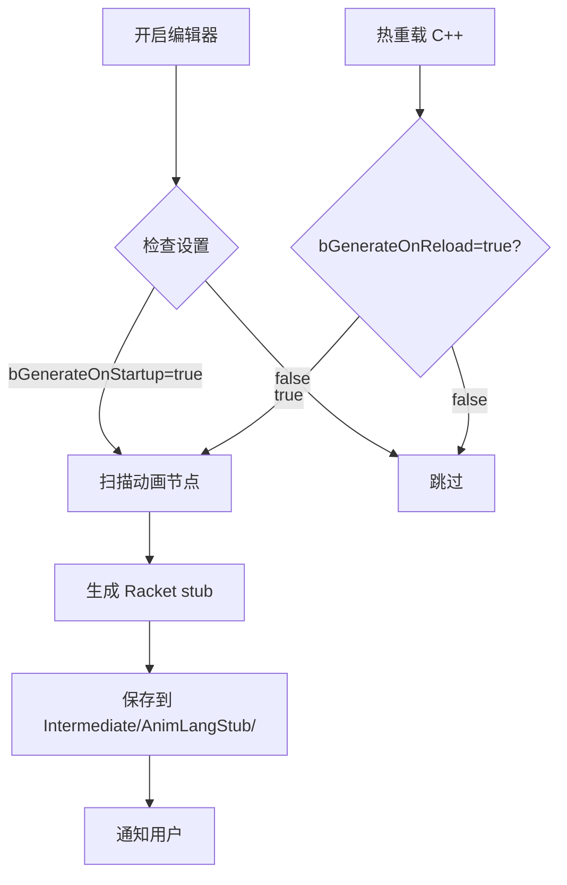

# UE Python Stub 机制分析与 AnimBP2FP 实现方案

## 📚 UE `unreal.py` 导出机制

### 1. **何时生成？**

UE 的 `unreal.py` stub 文件在以下情况下自动生成：

#### 触发条件
1. **开启 Developer Mode**
   - 路径: `Edit → Project Settings → Plugins → Python → Developer Mode`
   - 首次开启后重启编辑器

2. **生成位置**
   ```
   ProjectRoot/Intermediate/PythonStub/unreal.py
   ```

3. **自动更新时机**
   - 编辑器启动时
   - 加载新插件后
   - C++ 类反射系统变化时

#### 生成内容
- **所有 UObject 派生类**的 Python 绑定
- **函数签名**（参数类型、返回值）
- **属性定义**（类型、默认值）
- **文档字符串**（从 C++ 注释提取）

### 2. **实现原理**

#### C++ 反射驱动
```cpp
// UE 引擎源码 (PythonScriptPlugin)
// Engine/Plugins/Experimental/PythonScriptPlugin/Source/PythonScriptPlugin/Private/PyWrapperTypeRegistry.cpp

void FPyWrapperTypeRegistry::GenerateStubFile(const FString& OutputPath)
{
    // 遍历所有 UClass
    for (TObjectIterator<UClass> It; It; ++It)
    {
        UClass* Class = *It;
        
        // 生成类定义
        GenerateClassStub(Class, OutFile);
        
        // 生成函数定义
        for (TFieldIterator<UFunction> FuncIt(Class); FuncIt; ++FuncIt)
        {
            GenerateFunctionStub(*FuncIt, OutFile);
        }
        
        // 生成属性定义
        for (TFieldIterator<FProperty> PropIt(Class); PropIt; ++PropIt)
        {
            GeneratePropertyStub(*PropIt, OutFile);
        }
    }
}
```

#### 关键模块
- **PythonScriptPlugin**: 核心插件
- **PyWrapperTypeRegistry**: 类型注册表
- **PyGenUtil**: 代码生成工具

---

## 🎯 AnimBP2FP 仿照实现方案

### 方案对比

| 特性 | UE Python Stub | AnimBP2FP Racket Stub |
|------|----------------|------------------------|
| **触发方式** | 编辑器启动自动 | 编辑器命令/Commandlet |
| **生成位置** | `Intermediate/PythonStub/` | `Intermediate/AnimLangStub/` |
| **反射源** | UObject 系统 | UAnimGraphNode 子类 |
| **输出格式** | Python `.py` | Racket `.rkt` |
| **更新时机** | 编辑器启动 + 类变化 | 手动触发 + Git Hook |

---

## 🛠️ 实现方案（基于 UE Python Stub 模式）

### Phase 1: 编辑器集成（推荐） ⭐️

#### 1.1 创建编辑器模块

```cpp
// AnimBP2FPEditor.Build.cs
public class AnimBP2FPEditor : ModuleRules
{
    public AnimBP2FPEditor(ReadOnlyTargetRules Target) : base(Target)
    {
        PrivateDependencyModuleNames.AddRange(new string[]
        {
            "Core",
            "CoreUObject",
            "Engine",
            "UnrealEd",
            "AnimGraph",
            "BlueprintGraph",
            "AnimBP2FP"  // Runtime module
        });
    }
}
```

#### 1.2 注册自动生成钩子

```cpp
// AnimBP2FPEditorModule.cpp
class FAnimBP2FPEditorModule : public IModuleInterface
{
public:
    virtual void StartupModule() override
    {
        // 注册编辑器启动时的回调
        FCoreDelegates::OnPostEngineInit.AddRaw(this, &FAnimBP2FPEditorModule::OnEngineInit);
        
        // 注册资产重载时的回调
        FCoreUObjectDelegates::ReloadCompleteDelegate.AddRaw(this, &FAnimBP2FPEditorModule::OnReloadComplete);
    }
    
private:
    void OnEngineInit()
    {
        // 检查是否需要更新 stub
        if (ShouldRegenerateStub())
        {
            FAnimNodeExporter::ExportAllNodes(GetStubPath());
        }
    }
    
    void OnReloadComplete(EReloadCompleteReason Reason)
    {
        // 热重载后更新 stub
        FAnimNodeExporter::ExportAllNodes(GetStubPath());
    }
    
    bool ShouldRegenerateStub()
    {
        // 比较上次生成时间与编译时间
        FString StubPath = GetStubPath();
        if (!FPaths::FileExists(StubPath))
            return true;
        
        FDateTime StubTime = IFileManager::Get().GetTimeStamp(*StubPath);
        FDateTime EngineTime = FDateTime::Now();  // 简化，实际应检查 .dll 时间
        
        return EngineTime > StubTime;
    }
    
    FString GetStubPath()
    {
        return FPaths::ProjectIntermediateDir() / TEXT("AnimLangStub") / TEXT("animlang-nodes-generated.rkt");
    }
};
```

---

### Phase 2: 项目设置集成

#### 2.1 添加配置选项

```cpp
// AnimBP2FPSettings.h
UCLASS(config=Editor, defaultconfig)
class UAnimBP2FPSettings : public UDeveloperSettings
{
    GENERATED_BODY()
    
public:
    /** 是否自动生成 stub 文件 */
    UPROPERTY(Config, EditAnywhere, Category="AnimLang")
    bool bAutoGenerateStub = true;
    
    /** stub 输出路径 */
    UPROPERTY(Config, EditAnywhere, Category="AnimLang")
    FString StubOutputPath = TEXT("Intermediate/AnimLangStub/animlang-nodes.rkt");
    
    /** 是否在编辑器启动时生成 */
    UPROPERTY(Config, EditAnywhere, Category="AnimLang")
    bool bGenerateOnStartup = true;
    
    /** 是否在热重载后生成 */
    UPROPERTY(Config, EditAnywhere, Category="AnimLang")
    bool bGenerateOnReload = true;
};
```

#### 2.2 UI 界面

```
Edit → Project Settings → Plugins → AnimBP2FP
    ☑ Auto Generate Stub
    ☑ Generate On Startup
    ☑ Generate On Reload
    
    Output Path: Intermediate/AnimLangStub/
    
    [Generate Now] 按钮
```

---

### Phase 3: 编辑器菜单命令

#### 3.1 注册菜单项

```cpp
// AnimBP2FPCommands.cpp
void FAnimBP2FPCommands::RegisterCommands()
{
    UI_COMMAND(ExportNodes,
        "Export AnimLang Nodes",
        "Export all animation nodes to Racket stub file",
        EUserInterfaceActionType::Button,
        FInputChord());
}

// AnimBP2FPEditorModule.cpp
void FAnimBP2FPEditorModule::RegisterMenuExtensions()
{
    // Tools → AnimBP2FP → Export Nodes
    FToolMenuOwnerScoped OwnerScoped(this);
    UToolMenu* Menu = UToolMenus::Get()->ExtendMenu("LevelEditor.MainMenu.Tools");
    
    FToolMenuSection& Section = Menu->FindOrAddSection("AnimBP2FP");
    Section.AddMenuEntry(
        "ExportAnimLangNodes",
        LOCTEXT("ExportNodes", "Export AnimLang Nodes"),
        LOCTEXT("ExportNodes_Tooltip", "Generate Racket stub file from animation nodes"),
        FSlateIcon(),
        FUIAction(FExecuteAction::CreateRaw(this, &FAnimBP2FPEditorModule::ExportNodes))
    );
}
```

#### 3.2 使用方式

```
Tools → AnimBP2FP → Export Nodes
```

输出：
```
LogAnimBP2FP: Scanning 127 animation nodes...
LogAnimBP2FP: Generated stub file: Intermediate/AnimLangStub/animlang-nodes-generated.rkt
LogAnimBP2FP: Export complete!
```

---

### Phase 4: Commandlet（命令行）

#### 4.1 创建 Commandlet（已实现）

```cpp
// AnimNodeExporterCommandlet.cpp (已存在)
int32 UAnimNodeExporterCommandlet::Main(const FString& Params)
{
    FString OutputPath = TEXT("AnimLangNodes.rkt");
    FParse::Value(*Params, TEXT("output="), OutputPath);
    
    UE_LOG(LogTemp, Log, TEXT("Exporting animation nodes to %s"), *OutputPath);
    
    if (FAnimNodeExporter::ExportAllNodes(OutputPath))
    {
        UE_LOG(LogTemp, Log, TEXT("Successfully exported %d nodes"), GetNodeCount());
        return 0;
    }
    return 1;
}
```

#### 4.2 使用方式

```bash
# Windows
UnrealEditor-Cmd.exe YourProject \
  -run=AnimNodeExporter \
  -output=AnimLangNodes.rkt

# Linux/Mac
./UnrealEditor-Cmd YourProject \
  -run=AnimNodeExporter \
  -output=AnimLangNodes.rkt
```

---

## 📦 完整工作流（仿照 UE Python）

### 开发阶段



### 手动触发

```
方式1: Tools → AnimBP2FP → Export Nodes
方式2: Project Settings → AnimBP2FP → [Generate Now]
方式3: Commandlet (CI/CD)
```

---

## 🎯 对比 UE Python Stub 的优势

| 方面 | UE Python | AnimBP2FP Racket |
|------|-----------|------------------|
| **范围** | 所有 UObject（数万类） | 动画节点（~100 个） |
| **性能** | 较慢（5-10 秒） | 快速（<1 秒） |
| **更新频率** | 每次启动 | 按需生成 |
| **用户控制** | 自动 | 自动 + 手动 |

---

## 🛠️ 实施步骤

### Week 1: 编辑器集成
1. ✅ 创建 AnimNodeExporter（已完成）
2. ⏳ 创建 AnimBP2FPEditor 模块
3. ⏳ 注册启动/重载钩子
4. ⏳ 添加项目设置

### Week 2: UI 和命令
5. ⏳ 注册编辑器菜单
6. ⏳ 创建设置面板
7. ⏳ 测试自动生成

### Week 3: CI/CD
8. ⏳ Commandlet 完善
9. ⏳ Git Hook 集成
10. ⏳ 文档完善

---

## 📝 示例：生成的 Stub 文件

```racket
;; Auto-generated from Unreal Engine 5.6
;; Generated: 2026-03-23 21:00:00
;; Nodes: 127

;; ========== UAnimGraphNode_SequencePlayer ==========
;; Play a single animation sequence
(: sequence-player (->* (AnimSequence)
                        (#:loop Boolean
                         #:play-rate (U Float Symbol)
                         #:start-position Float
                         #:blend-in-time Float
                         #:blend-out-time Float)
                        AnimNode))

;; ========== UAnimGraphNode_BlendSpacePlayer ==========
;; Sample a blend space with input parameters
(: blendspace-1d (->* (BlendSpace)
                      (#:axis Symbol
                       #:loop Boolean
                       #:play-rate (U Float Symbol))
                      AnimNode))

;; ... (125 more nodes)
```

---

## 🔗 相关文件

| 文件 | 状态 | 说明 |
|------|------|------|
| `AnimNodeExporter.h/cpp` | ✅ 已创建 | 核心导出逻辑 |
| `AnimBP2FPEditor.Build.cs` | ⏳ 待创建 | 编辑器模块 |
| `AnimBP2FPEditorModule.cpp` | ⏳ 待创建 | 启动钩子 |
| `AnimBP2FPSettings.h` | ⏳ 待创建 | 项目设置 |
| `AnimBP2FPCommands.cpp` | ⏳ 待创建 | 菜单命令 |

---

**总结**: AnimBP2FP 可以完全仿照 UE Python Stub 的机制，实现自动导出。推荐先实现编辑器菜单（快速验证），再集成自动触发（生产环境）。

**最后更新**: 2026-03-23 21:05 GMT+8